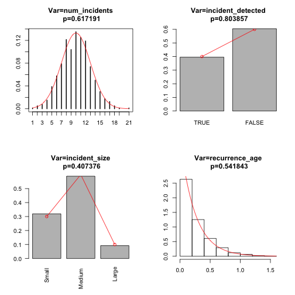

<style>
.small-code pre code {
  font-size: 1em;
}
</style>

Simulating Datasets
========================================================
author: Walt Wells
date: December 2017
autosize: true
transition: rotate
transition-speed: slow

<a href="https://github.com/occ-data/data-simulator">github.com/occ-data/data-simulator</a>

Motivation
========================================================

__Thesis:__  It is sometimes necessary to create simulated data when it is impractical to obtain real data.   This is an important technique to generate data that can be used for building models or running data services.    

__Possible Reasons to Simulate:__  Legal restrictions;   Protected datasets;  PHI;  Data access is impractical or does not scale 


Immediate Motivation
========================================================

__Building a DataCommons:__  
The [Open Commons Consortium](http://occ-data.org/) is partnering around a project-specific data commons that will contain a great deal of protected data.   Data Contributor legal agreements are in slow review, and to meet our benchmarks, we need to start standing up services and prepare analysis pipelines over metadata. 

__Solution:__ 
Work with the data contributor to generate a compendium that statistically represents their planned data submission.   


What does this Suite do?
========================================================

The functions in this simulation suite allow a user to:

*  Create a compendium of variables to simulate based on the desired statistical properties of each variable
*  Simulate and optionally validate data
*  Organize simulated data by nodes in a data model and export to json for easy import and validation of a data commons data dictionary


Structure / Process Diagram
========================================================


What is the Compendium?
========================================================
class: small-code

In order to simulate a dataset, a compendium must be filled out.   The fields can be grouped into three classes: 

* Metadata:  DESCRIPTION, VARIABLE 
* Data Model:  NODE, REQUIRED
* Statistical Properties: TYPE, CHOICES, PROBS, DISTRIB, DISTRIB.INPUTS, NAS 

## Load a Sample Compendium


```r
compendium <- read.csv("https://raw.githubusercontent.com/occ-data/data-simulator/master/SampleCompendium/toyCompendium.csv", header=T, stringsAsFactors = F)
```

Basic Simulation
========================================================
class: small-code

Below we'll do a basic simulation where we do not include NA creation but do not reject any simulations.  


```r
n <- 1000 #simulate this many observations
SimulatedData <- simData(compendium, n, include.na = FALSE, reject=FALSE)
head(SimulatedData)
```

```
  id num_incidents incident_detected incident_size recurrence_age
1  1             5             FALSE        Small      0.04960057
2  2            12             FALSE       Medium      0.05780482
3  3             9             FALSE       Medium      0.56871607
4  4            15              TRUE       Medium      0.10937817
5  5             4              TRUE       Medium      0.28427252
6  6            12              TRUE        Small      0.11316996
```

Simulating with Validation
========================================================
class: small-code

Here we'll do a slightly more advanced simulation, this time including NA creation.  We'll also use our validation function to test and reject any simulations that do not conform to our desired statistical properties.  


```r
SimulatedData2 <- simData(compendium, n, include.na = TRUE, 
                         reject=TRUE, threshold=.4)
head(SimulatedData2)
```

```
  id num_incidents incident_detected incident_size recurrence_age
1  1             7             FALSE        Small      0.46643200
2  2             9              TRUE         Large             NA
3  3            11             FALSE         Large     0.12575510
4  4            NA                NA       Medium      0.23591631
5  5            NA             FALSE       Medium      0.05843747
6  6            NA              TRUE       Medium      0.06640986
```

Validation Plotting
========================================================
class: small-code


```r
variables <- compendium$VARIABLE; par(mfrow = c(2, 2))
for (i in variables) {validateVar(i, compendium, SimulatedData2, include.plot=T)}
```



Data Dictionary Validation:  Sim to Json
========================================================

An additional use case for data simulation is to validate the data dictionaries that power a data commons. The SimtoJson.R function takes a simulated dataset and converts it to json to easily ingest into a data commons.   Visit the [Gen3 Wiki](https://uc-cdis.github.io/gen3-user-doc/) for more details about data commons architecture.  Below is an example of the data model for the [BloodPAC Data Commons](https://www.bloodpac.org/data-group/).


Summary
========================================================

If real data is not available, a user can use this suite to simuate the desired dataset(s).  

*  Create a compendium of variables to simulate based on the desired statistical properties
*  Simulate and optionally validate data
*  Organize simulated data by nodes in a data model and export to json for easy upload

Special thanks to Robert Grossman, Ph.D (Director) and Francisco Ortuno, Ph.D;  (Senior Bioinformatician) at the [Center for Data Intensive Science](https://cdis.uchicago.edu/) at University of Chicago for help planning this suite. 

<a href="https://github.com/occ-data/data-simulator">github.com/occ-data/data-simulator</a>

References
========================================================

* [Design and validation of a data simulation model for longitudinal healthcare data.](https://www.ncbi.nlm.nih.gov/pubmed/22195178) R.E. Murray, P.B. Ryan, S.J. Reisinger
* [Simulation Study to Validate Sample Allocation for the National Compensation Survey](https://www.bls.gov/osmr/pdf/st130210.pdf), H.J. Lee, T. Li, K. Teuter, C.H. Ponikowski, G.R. Ferguson
* [Polyester: simulating RNA-seq datasets with differential transcript expression.](https://www.ncbi.nlm.nih.gov/pubmed/25926345), A.C. Frazee, A.E. Jaffe, B. Langmead, J.T. Leek
* [Expert simulation system based on a relational database](http://ieeexplore.ieee.org/document/129552/?section=abstract), R.E. Shannon, M.A. Centeno
* [Creating Realistic Data Sets With Specified Properties Via Simulation](http://archives.math.utk.edu/ICTCM/VOL18/C131/paper.pdf), R. Goldman, J.D. McKenzie, Jr.
    
