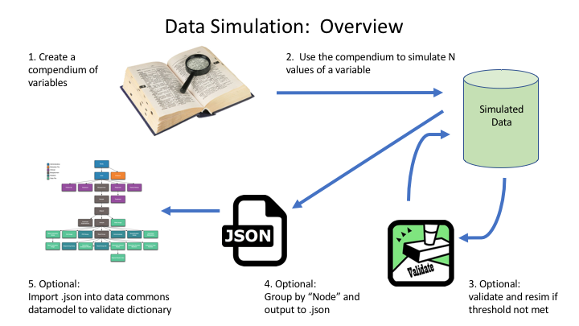

# Simulating Data Sets

# Background, Purpose, Significance

It is sometimes necessary to create simulated data when it is impractical to obtain real data.   This is an important technique to generate data that can be used for building models or running services over datasets that may have protected information or may not be available for legal reasons.      

#### Possible motivations for simulating data:

* Legal restrictions
* Protected datasets / PHI
* Data access is impractical or does not scale 
* Need more datapoints

#### The functions in this simulation suite allow a user to:

*  Create a compendium of variables to simulate based on the desired statistical properties
*  Simulate and validate data
*  Organize simulated data by nodes in a data model and export to json for easy upload

### Near Term Motivation 

#### Building a DataCommons:

The [Open Commons Consortium](http://occ-data.org/) is partnering around a project-specific data commons that will contain a great deal of protected data. Data Contributor legal agreements are in slow review, and to meet our benchmarks, we need to start standing up services and prepare analysis pipelines over metadata.

#### Solution: 

Work with the data contributor to generate a compendium that statistically represents their planned data submission.  The data contributor assiged a statistician to come up with the distributions and properties that describe each variable in their proposed submission.   From this we generated a compendium and followed the steps outline below to create a simulation of their data submission. 

# Structure / Process Diagram



# Data Simulation

### Environment Prep

#### Load Functions to Sim and Validate

```{r}
source('https://raw.githubusercontent.com/occ-data/data-simulator/master/SimData.R')
source('https://raw.githubusercontent.com/occ-data/data-simulator/master/ValidateFunction.R')
source('https://raw.githubusercontent.com/occ-data/data-simulator/master/SimtoJson.R')
```

## The Compendium

### What is the Compendium?

In order to simulate a dataset, a compendium must be filled out.   The compendium can be prepared as a spreadsheet outside of R and then loaded to complete the simulation. 
Compendium fields are as follows:

* __DESCRIPTION__ describes the variable
* __NODE__ we use a graphing representation of data to build out a data commons.   A node represents where the simulated data will sit in a the data model.  A sample model can be found at: https://www.bloodpac.org/data-group/
* __VARIABLE__ the name of the variable
* __REQUIRED__ boolean representing whether this will be a required value in the data model
* __TYPE__  options: enum, boolean, number, integer.   This field dictates the logic in the following fields.  
* __CHOICES__  If enum, this represents the enum options
* __PROBS__  If enum or boolean this represents the probabilites for each option.   If boolean, the first probability represents `TRUE`
* __DISTRIB__ If number or integer, this field represents the distribution that best represents the data. 
* __DISTRIB.INPUTS__  If number or integer, this field represents the distribution inputs (eg, mean, sd, lambda, etc)
* __NAS__ proportion of the variable that should be NA.

The fields can be grouped into three classes:

* Metadata: DESCRIPTION, VARIABLE
* Data Model: NODE, REQUIRED
* Statistical Properties: TYPE, CHOICES, PROBS, DISTRIB, DISTRIB.INPUTS, NAS

Sample compendiums are available at: https://github.com/occ-data/data-simulator/tree/master/SampleCompendium

### Load a Compendium

A sample compendium has been created to model a dataset coming from a clinical patient environment with surveys, measurements, etc.  

```{r}
compendium <- read.csv("https://raw.githubusercontent.com/occ-data/data-simulator/master/SampleCompendium/sampleClinical.csv", header=T, stringsAsFactors = F)
```

### Review the Compendium

Below are the last 6 rows of the compendium we'll simulate later on.

```{r}
tail(compendium, 6)
```

## Simulation

### How Does Simulation Work?

Once a compendium is created, simulation relies on the functions in SimData.R and (optionally - see V2 below) the functions in ValidateFunction.R. 

At a very high level, the functions in SimData.R:

* follow a branching logic to determine the simulation path based on the `TYPE` option in the compendium (eg - enum, boolean, number, integer)
* follow the simulation path to get the details and parameters for conducting the simulation (eg - `TYPE` == number, convert the compendium strings for the distribution and parameters (eg - `DISTRIB` == normal, `DISTRIB.INPUTS` == mean=10, sd=2))
* provide reasonable error handling to help identify potential formatting errors in the compendium
* for each row in the compendium, simulate N times
* If the sim NA flag is up, add the correct percentage of NAs to each variable
* Optionally:  run a statistical test to validate simulation (see the Validation section)

The simulation currently supports and validates for the normal, uniform, poisson and exponential distributions.   It would be relatively simple to expand support for additional distributions or custom functions should a dataset require them. 

## Validation

### How Does Validation Work?

When running a simulation there is an option to resimulate a variable if it does not match the desired distribution closely enough.  This is generally done by comparing the simulated distribution to the theoretical distribution using:  

* Chi Square tests (`TYPE` == integer or enum)
* Binomial tests (`TYPE` == boolean)
* Kolmogorov-Smirnov tests (`TYPE` == number)

For lack of an alternative metric that is consistent across tests, the p-value is used as the benchmark output when running a validation test. 

Similar to the functions in SimData.R, it would be relatively simple to expand support for additional distributions or custom functions should a dataset require them. 

### What Validation Options are there?

There are a few available methods for utilizing the functions in ValidationFunction.R.  At a very high level:

*  After a completed simulation:  Plot the simulated vs. the theoretical, show the p-value, and display a "reject" flag if the p-value is below an input threshold. 
*  During a simulation:  Run the validation steps without plotting, and if the p-value is less than an input threshold, reject the simulated variable and resim until the test is passed. 

## Example Simulations 

### V1: Simulate Data w/o Rejecting

In the attempt below, we'll include the creation of NAs, but not reject any of the variables simmed.   We'll accept the first simulation run of each variable.

```{r}
n <- 1000 #simulate this many observations

SimulatedData <- simData(compendium, n, include.na = TRUE, reject=FALSE)

#write.csv(SimulatedData, "mySimData.csv") #data could easily output to csv
```

#### Plot Simmed Data

```{r}
threshold <- .05 #reject variables that fail test below this
variables <- compendium$VARIABLE

par(mfrow = c(2, 3))
for (i in variables) {
    validateVar(i, compendium, SimulatedData, threshold, include.plot=T)
}
```

### V2: Simulate Data Rejecting

We may want more QC to make sure our simulated variables match our projected distributions.    We can reject a simulation and resimulate it until it meets a declared threshold (p > x for the appropriate test).    

Below, we set a very high p-value and let it run until all simulated variables meet our threshold. 

__NOTE__ for a very low n (< 100), don't use the reject method.   The assigned statistical test is likely to fail.  

```{r}
SimulatedData2 <- simData(compendium, n, include.na = TRUE, 
                         reject=TRUE, threshold=.6) # set a very high threshold
#write.csv(SimulatedData2, "mySimData2.csv")
```

#### Plot Simmed Data 

Here we'll see values > than the threshold set in the simulation call above. 

```{r}
par(mfrow = c(2, 3))
for (i in variables) {
    validateVar(i, compendium, SimulatedData2, include.plot=T)
}
```

## Optional: Data Dictionary Validation

An additional use case for data simulation is to validate the data dictionaries that power a data commons. The SimtoJson.R function takes a simulated dataset and converts it to .json to easily ingest into a data commons. Visit the [Gen3 Wiki](https://uc-cdis.github.io/gen3-user-doc/) for more details about data commons architecture. Below is an example of the data model for the [BloodPAC Data Commons](https://www.bloodpac.org/data-group/).


To easily add simulated entries into a data commons, use the function in SimtoJson.R.   Once satisfactory data is simulated, the SimtoJson function will group by nodes in the data model (a column in the compendium) and create json output for easy import.

```{r, eval=FALSE}
n <- 10
SimulatedData <- simData(compendium, n, 
                         include.na = TRUE, 
                         reject= FALSE)

SimtoJson(SimulatedData, compendium, 'JsonOutput/')
```

Sample simulated data resulting from this function call can be found at: https://github.com/occ-data/data-simulator/tree/master/JsonOutput

# Conclusions 

Creating a suite to simulate a dataset has been a very helpful and interesting exercise.   I expect to utilize similar techniques throughout my career when it is necessary to work with protected or unavailable data in order to stand up services or build/train models.   

Of particular value to me as a student was working through the demands of the validation suite.   It forced me to dig deeper and solidify my understanding of the methods for relatively well known statistical comparisons like the Chi Square test, Kolmogorov-Smirnov test, and the Binomial test.  

Currently out of scope for this simulation suite are two things that a user may seek:   

1)  If this data seeks to model an existing dataset, it does not take into account the statistical relationships between different variables.   It only simulates on the properties of a single variable.  
2)  There is currently no method to add additional noise to the data as part of the simulation.   It is assumed that this is added to the data through the simulation process.  Adding additional noise could be done to the resulting simulation easily outside this package. 

I hope to continue to update and improve this simulation suite as new requirements and demands become apparent from stakeholders and users.   Once the suite feels mature, it may be of interest to submit it CRAN as an R library, if it seems that it may provide some additional utility for the research community.  

# References

## Special Thanks

Special thanks to Robert Grossman, Ph.D (Director) and Francisco Ortuno, Ph.D; (Senior Bioinformatician) at the Center for Data Intensive Science at University of Chicago.

## Publications

* [Design and validation of a data simulation model for longitudinal healthcare data.](https://www.ncbi.nlm.nih.gov/pubmed/22195178) R.E. Murray, P.B. Ryan, S.J. Reisinger
* [Simulation Study to Validate Sample Allocation for the National Compensation Survey](https://www.bls.gov/osmr/pdf/st130210.pdf), H.J. Lee, T. Li, K. Teuter, C.H. Ponikowski, G.R. Ferguson
* [Polyester: simulating RNA-seq datasets with differential transcript expression.](https://www.ncbi.nlm.nih.gov/pubmed/25926345), A.C. Frazee, A.E. Jaffe, B. Langmead, J.T. Leek
* [Expert simulation system based on a relational database](http://ieeexplore.ieee.org/document/129552/?section=abstract), R.E. Shannon, M.A. Centeno
* [A preclinical simulated dataset of S-values and investigation of the impact of rescaled organ masses using the MOBY phantom](http://iopscience.iop.org/article/10.1088/0031-9155/61/6/2333/meta), T. Kostou, P. Papadimitroulas, G. Loudos, G.C. Kagadis
* [Creating Realistic Data Sets With Specified Properties Via Simulation](http://archives.math.utk.edu/ICTCM/VOL18/C131/paper.pdf), R. Goldman, J.D. McKenzie, Jr.
     
## Web / Blogs

* https://stats.idre.ucla.edu/r/codefragments/mesimulation/
* https://cran.r-project.org/web/packages/simstudy/vignettes/simstudy.html
* http://www.statisticalassociates.com/simulateddata.pdf
* https://web.stanford.edu/class/bios221/labs/simulation/Lab_3_simulation.html
