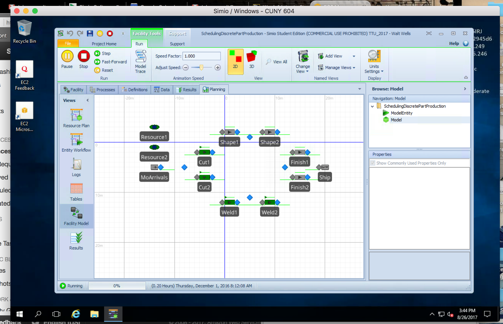

# Simio Installation

As a Mac user, I found a sustainable and relatively inexpensive way to manage the requirements for Simio.    I am using Microsoft Remote Desktop for Mac to login to a Windows machine image on AWS EC2, where my student license for Simio is installed.    It is possible to both stop the VM and change image size (should a project require more resources) and still retain the existing license.  If careful to stop the VM when not in use, it should cost no more than $15 a month. 

The image below is a screenshot of my connection, and Simio running the "Discrete Part Production" demo.  

# My Course Goal

I look forward to learning about a variety of simulation and modeling techniques.   In particular, I hope to discover what types of problems one would apply these techniques to, better understand the resources required to run simulations at different scales, and get a sense of the state of the art in the field.  