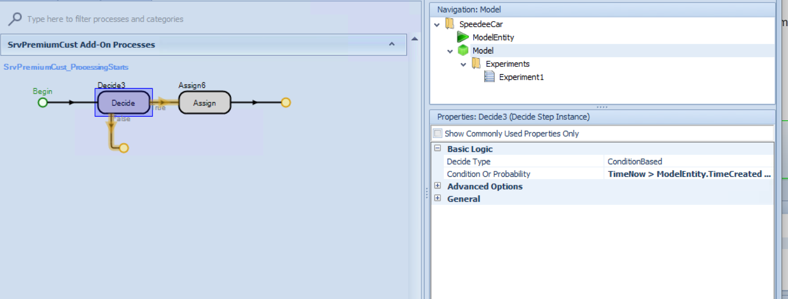
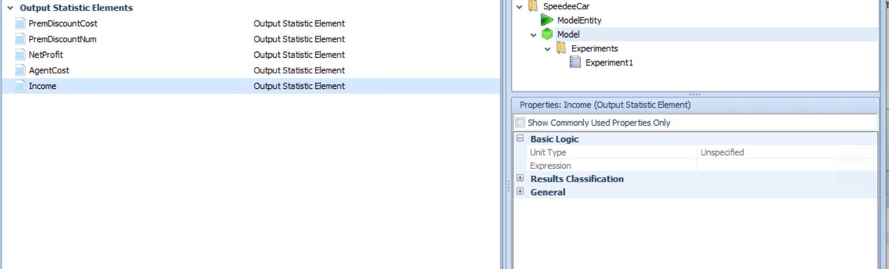

# Kelton 8.4.5

Speedee Car Rentals is open 24 hours and has two classes of customers - 25% are premium customers who are promised a waiting time of < 5 minutes from when they enter or they will receive a \$15 discount on their rental.   The others are regular customers who will wait as long as they have to wait.   Customers arrive about 2 minutes apart (exponential) and move about 4 meters at 1 mile per hour to either the premium counter (1 agent) or the regular counter (2 agents).   All customers have a uniformly distributed service time of from 2 to 7 minutes.   Each agent costs \$55 per hour (including overhead) and each customer completed contributes \$8 to income (minus any discount they might have received).  

Model this system without using any links.   Run for 10 days per replication.   For each scenario, report the utilization of each type of agent and the waiting time of each type of customer.   Both on-screen and in the output, report the number of premium customers who received a discount, the total discounts paid, and the net profit (after discounts and costs) of the system.

* Scenario a)  Assume that each agent only handles customers of his designated type. 
* Scenario b) Relax the above assumption.   Consider alternative work rules (who services which customer under which conditions) for this same staff.   Evaluate each proposed scenario to see the impact on the metrics.
* Scenario c)  Model other possible solutions to improve the system.  You may use links if that helps. 

## Setup

Model available at: https://github.com/wwells/CUNY_DATA_604/raw/master/Section10/SpeedeeCar.spfx

### Scenario A 

### Scenario B

## Tables

## Processes & State Definitions

## Results

### Scenario A

# References

* https://ashkannegahban.com/lab-8-user-defined-statistics-tally-state-and-output-statistics-in-simio/
