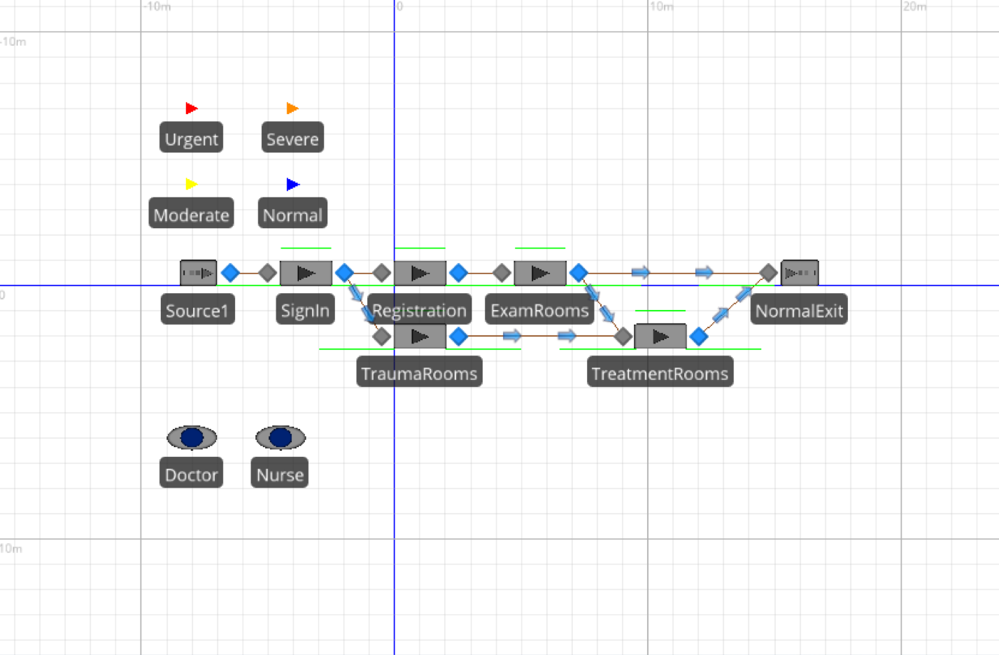
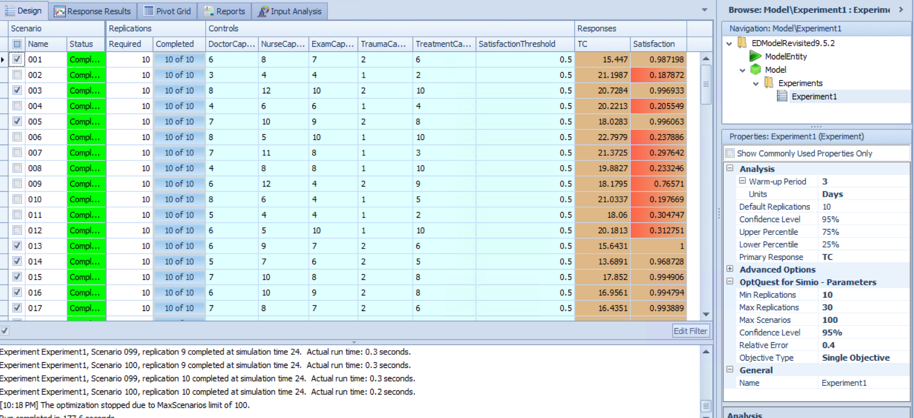
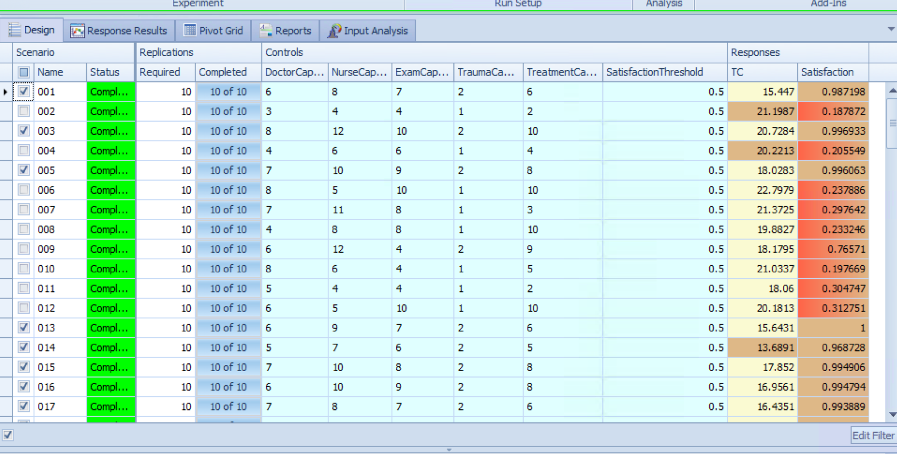
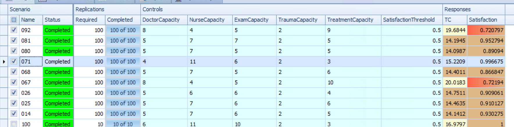
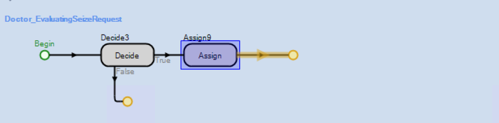
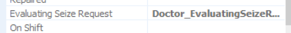
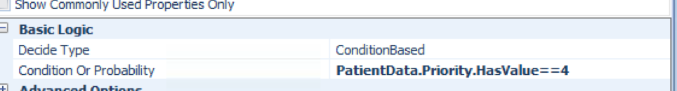
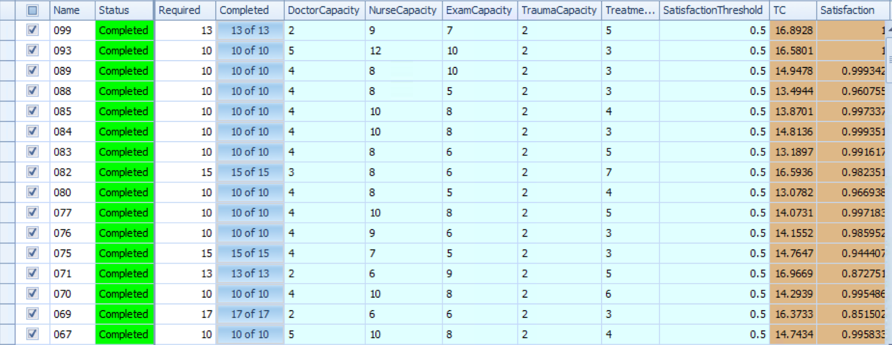

# Kelton 9.5.2

Modify Model 9-1 to support preemption of the Doctor resource for Urgent patients.   In particular, if all doctors are busy when an Urgent patient arrives, the Urgent patient should preempt a doctor from one of the other non-Urgent patients.   Compare the results of the models.   Would you advise that the emergency department make the corresponding change in the real system?

# Model

Model available at: https://github.com/wwells/CUNY_DATA_604/raw/master/Section11/EDModelRevisited9.5.2.spfx

# OptQuest

Here is our initial scenario run to determine some of the best parameters. 

Run KN over subset:

## Evaluating Seize Request

If an Urgent Patient enters the system and all Doctors are assigned, the doctor should be reassigned.   The approach here is to create an evaluation step around seize requests.   

## Redesign Results

