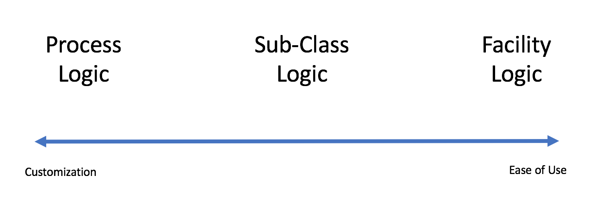

# Kelton 10.7.1

Compare and contrast the three ways of creating model logic.   What determines your choice when creating a specific object?

## Defining Model Logic:  Tradeoff Space

### Facility Model Logic

Facility model logic is the out-of the box logic for any Simio model objects.   Pull in an object, and customize as required.  

### Subclass Model Logic

Subclass model logic allows a user to take an existing object and create a subclass with customized behavior.  

### Process Model Logic

Process model logic allows the highest level of granular definition, letting the user define each aspect of the object's behavoir.   Ultimately, each of the above methods was defined using process logic.  
