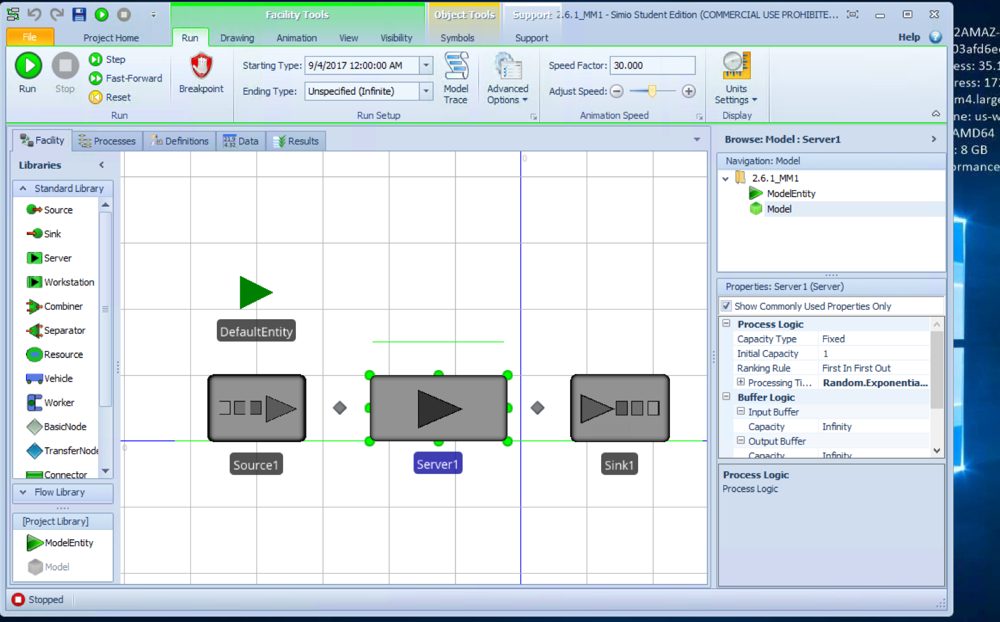
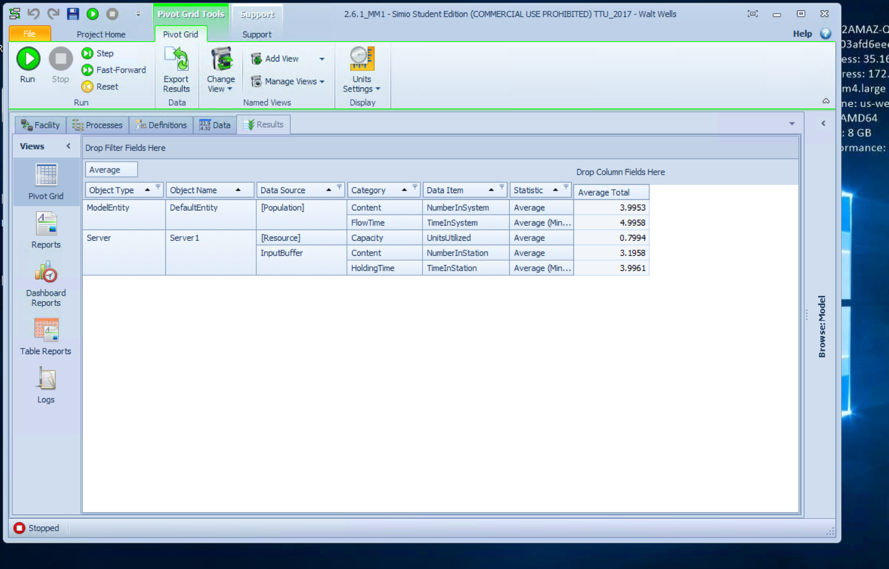

# 2.6.1 M/M/1

Given: 

* Avg InterArrival Time = 1.25 min
* Avg Service Time = 1 min

find Wq, W, Lq, L, p

```{r}
MM1 <- function(ArrivalAvg, ServiceAvg) {
    # simulation of an MM1 Queue system
    #
    # Args: 
    #   ArrivalAvg: avg time between arrivals into system
    #   ServiceAvg: avg time at service station
    #
    # Returns:
    #   summary df showing - 
    #   Wq: avg time spent in queue
    #   W:  avg time spent in system
    #   Lq:  avg num entitites in queue
    #   L:  avg number of entities in the system
    #   p:  server utilization rate
    
    lambda <- 1 / ArrivalAvg
    mu <- 1 / ServiceAvg
    
    p <- lambda / mu
    Lq <- p^2 / (1 - p)
    L <- p / (1 - p)
    W <- 1 / (mu * (1-p))
    Wq <- p / (mu * (1-p))
    
    results <- data.frame(Wq, W, Lq, L, p)
    results
}
```

```{r}
results <- MM1(1.25, 1)
knitr::kable(results)
```

## Confirm our results using Simio 

First I built the model with the desired parameters.   I then let the simulation run for a few virtual years. 
<br><br>


<br><br>
I then created a simple view to pull out the desired results.   You can see they are the same as our models above. 
<br><br>


