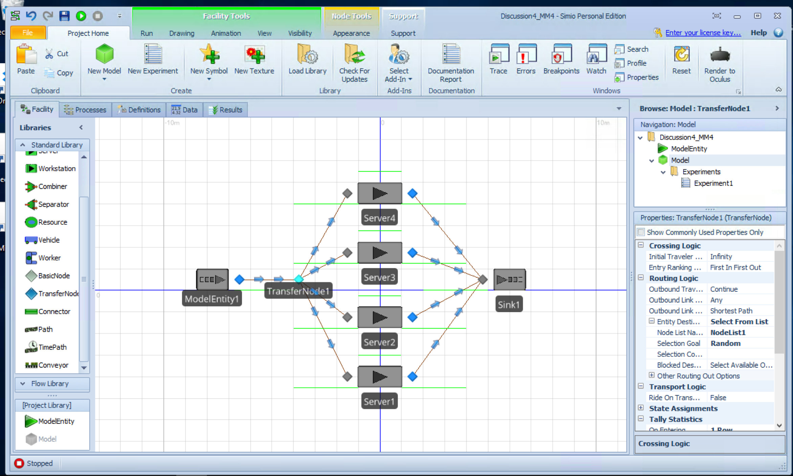
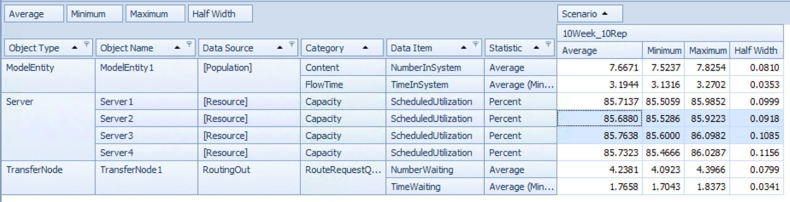
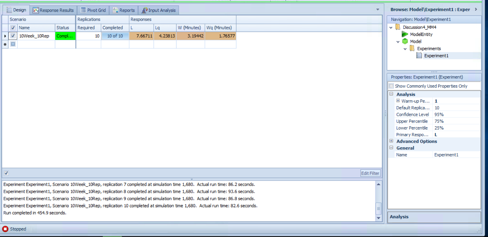
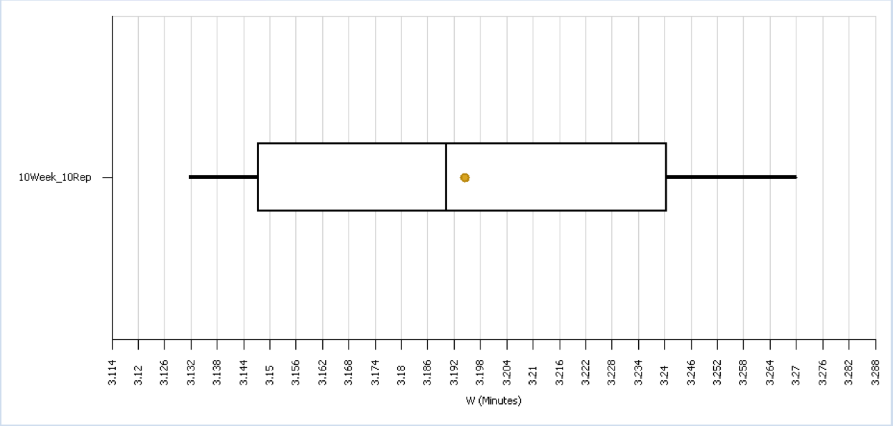

# 4.10.14 - b) M/M/4

* Arrival rate $\lambda$ = 2.4 min
* Service rate $\mu$ = 0.7 min

## Steady State

```{r}
MMC <- function(lambda, mu, c){
    # simulation of an MMC Queue system
    #
    # Args: 
    #   lambda: arrival rate
    #   mu: service time at each c
    #   c:  number of servers
    #
    # Returns:
    #   summary df showing - 
    #   Wq: avg time spent in queue
    #   W:  avg time spent in system
    #   Lq:  avg num entitites in queue
    #   L:  avg number of entities in the system
    #   p:  server utilization rate
    
    p <- lambda / (c * mu)
    
    # get steady state probability the system is empty
    i <- c(0:(c-1))
    first <- sum((c * p) ^ i / factorial(i))
    p0 <- 1 / (first + (c * p) ^ c / ( factorial(c) * (1-p)))  
    
    Lq <- ((p*(c*p)^c)*p0) / (factorial(c)*(1-p)^2)
    Wq <- Lq / lambda
    W <- Wq + 1 / mu
    L <- Lq + lambda / mu
    
    results <- data.frame(Wq, W, Lq, L, p)
    results    
}
```

```{r}
MM4 <- MMC(2.4, 0.7, 4)
knitr::kable(MM4)
```

## Simio Model 

The biggest challenge here was understanding how to handle multiple servers so that one server didn't gain preference.   I found an answer in the sample "SimBits".   To make the routing correct, I did the following:  

1)  created a transfer node which would serve as a single queue
2)  created an inputlist with each of the servers
3)  assigned the inputlist as the output of the transfer node with a routing preference for "available"
4)  made sure that each server had an input buffer of "0" indicating it could not build it's own queue.  

A link to the full Simio file is at https://github.com/wwells/CUNY_DATA_604/blob/master/Section4/Discussion4_MM4.spfx

### Model overview 



### Experiment setup

Then an experiment was setup to run the model for 10 weeks each, 10 times, and request a 95% confidence interval.   We allowed a 1hr warm up period for each run.

### Experiment results



### Experiment response variables

It was also interesting to setup response variables for W, Wq, L, and Lq.   From that we can get plots of our experiment distribution.  



#### Sample Boxplot of W values 

A sample boxplot showing the distribution of our W values over each of the 10 experiment runs is shown below. 

