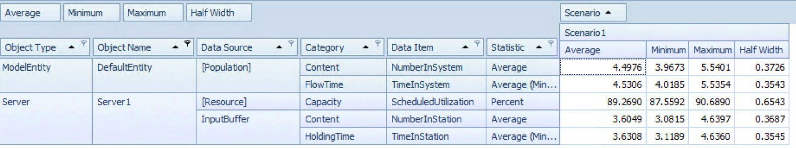
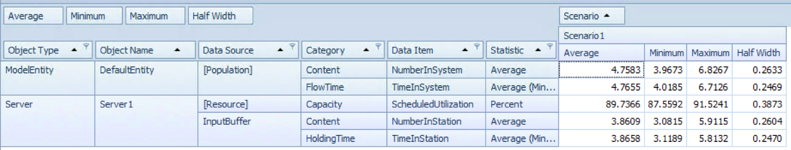
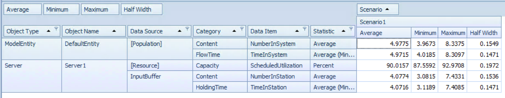
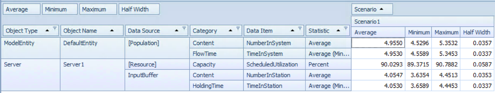

# 2.6.9 M/D/1

* Arrival rate $\lambda$ = 1 min
* Service rate $\mu$ = 1/0.9 min

Find all five stead-state queueing metrics for an M/D/1 queue, where D denotes a deterministic "distribution", ie., the associated RV (in this case representing service times) is a constant with no variation at all (also called a degenerate distribution).   State parameter conditions for your results to be valid.  Compare your results to those if D were replaced by a distribution with mean equal to the constant value from the original D distribution, except having at least some variation.  

To solve this, we'll simply use our MG1 formula, and make our G a contstant RV by setting the standard deviation to 0. 

```{r}
MG1 <- function(ArrivalAvg, es, sd) {
    # simulation of an MG1 Queue system
    #
    # Args: 
    #   ArrivalAvg: avg time between arrivals into system
    #   es:  expected value of the service time distribution
    #   sd:  standard deviation of the service time distribution
    #
    # Returns:
    #   summary df showing - 
    #   Wq: avg time spent in queue
    #   W:  avg time spent in system
    #   Lq:  avg num entitites in queue
    #   L:  avg number of entities in the system
    #   p:  server utilization rate
    
    lambda <- 1 / ArrivalAvg
    mu <- 1 / es
    
    p <- lambda / mu
    Wq <- (lambda * (sd^2 + 1/mu^2)) / (2 * (1 - lambda/mu))
    W <- Wq + es
    Lq <- lambda * Wq
    L <- lambda * W
    
    results <- data.frame(Wq, W, Lq, L, p)
    results
}
```

## Steady D

```{r}
es <- .9
sd <- 0
MD1 <- MG1(1, es, sd)
```

## Slightly Random D

```{r}
es <- .9
sd <- .2
MD1_Var <- MG1(1, es, sd)
```

## Compare

```{r}
df <- rbind(MD1, MD1_Var)
rownames(df) <- c("MD1", "MD1_Var")
knitr::kable(df)
```

As we would expect our time in system is just our time in 1ueue + our service rate when D is a constant.

# 4.10.15 M/D/1 in Simio

Build a Simio model to confirm and cross-check the steady-state queuing-theoretic results from 2.9.   Run a Simio Experiment to deal with issues like warm-up, run length, etc.   Compare sim results and CI with the queuing-theoretic steady-state results in 2.9.    

The Model is available at https://github.com/wwells/CUNY_DATA_604/blob/master/Section4/HW4_MD1.spfx

## Building Model


## Experiments

Running different experiments called out some interesting issues.   In all experiments we sought a 95% confidence interval, and allowed for a 1 day warm up period.  

### 1 Week Sample, 10X rep



### 1 Week Sample, 25X rep



### 1 Week Sample, 100X rep




Around 100 replications we can see results that are finally converging with our steady state theoretical calculations.  

### 10 Week Sample, 100X rep

And here we see something like real convergence around a 10 Week Sample at 100 replications.    

