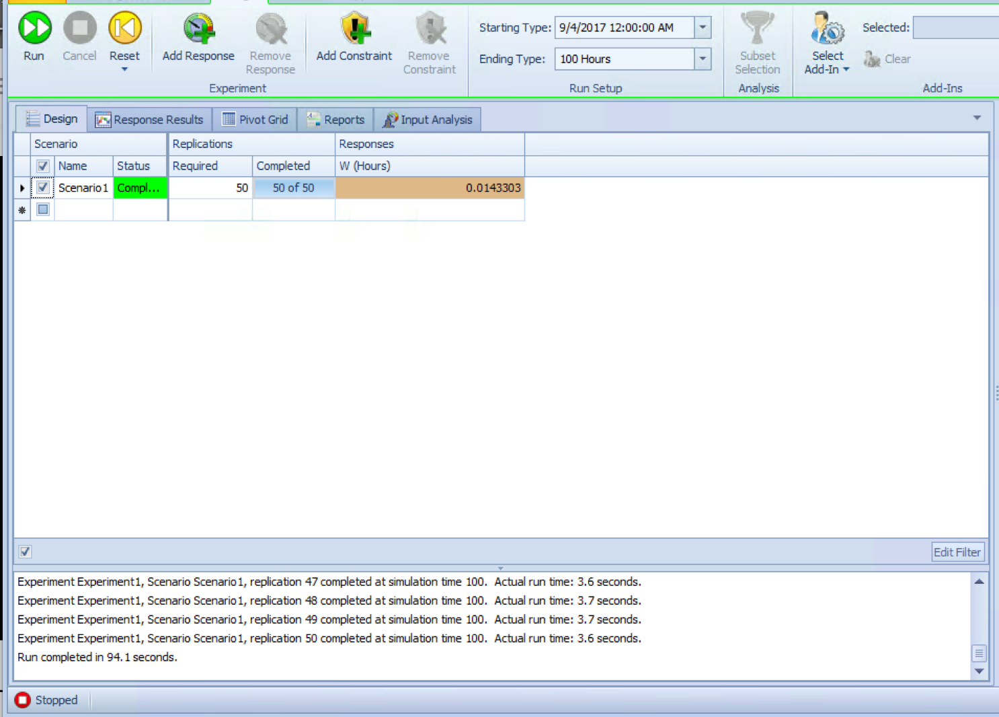

# Simio Model

The Simio model for which the below answers were devised, can be found at https://github.com/wwells/CUNY_DATA_604/blob/master/Section5/HW5_MM1.spfx.

# 4.10.2 Steady State

M/M/1 model (Model in section 4.1), compute exact values for W (avg time spent in system) and number of entities processed in 100 hrs.  

* $\lambda$ = 120 per hour
* $\mu$ = 190 per hour 

```{r}
MMC <- function(lambda, mu, c){
    # simulation of an MMC Queue system
    #
    # Args: 
    #   lambda: arrival rate
    #   mu: service time at each c
    #   c:  number of servers
    #
    # Returns:
    #   summary df showing - 
    #   Wq: avg time spent in queue
    #   W:  avg time spent in system
    #   Lq:  avg num entitites in queue
    #   L:  avg number of entities in the system
    #   p:  server utilization rate
    
    p <- lambda / (c * mu)
    
    # get steady state probability the system is empty
    i <- c(0:(c-1))
    first <- sum((c * p) ^ i / factorial(i))
    p0 <- 1 / (first + (c * p) ^ c / ( factorial(c) * (1-p)))  
    
    Lq <- ((p*(c*p)^c)*p0) / (factorial(c)*(1-p)^2)
    Wq <- Lq / lambda
    W <- Wq + 1 / mu
    L <- Lq + lambda / mu
    
    results <- data.frame(Wq, W, Lq, L, p)
    results    
}
```

```{r}
MM1 <- MMC(120, 190, 1)
knitr::kable(MM1)

print(paste0("Our M/M/1 system can process ", 100 / MM1$W, " entities in 100 hours"))
```


# 4.10.3 SMORE

Run an experiment for 100 hrs with 100 replications.   Response = W.  Show an interesting SMORE plot.   


# 4.10.9 Simio Process

Build the above M/M/1 using Simio Process.   Compare the run times for this model with the non-process model for 50 replications of length 100 hrs.  

## Standard Library


## Process Model


## Results

* Standard Library:  94.1 seconds
* Process Model:  13 seconds

If we know what statistic we want to measure, creating a process for it drastically cuts run time.   I can imagine for more complex systems that require serious computational resources to model this would be incredibly valuable.   

# 4.10.12 Animation

Animate your Problem 1 model assuming you are modeling a cashier at a fast-food restaurant.  Use Simio's standard animation symbols. 

