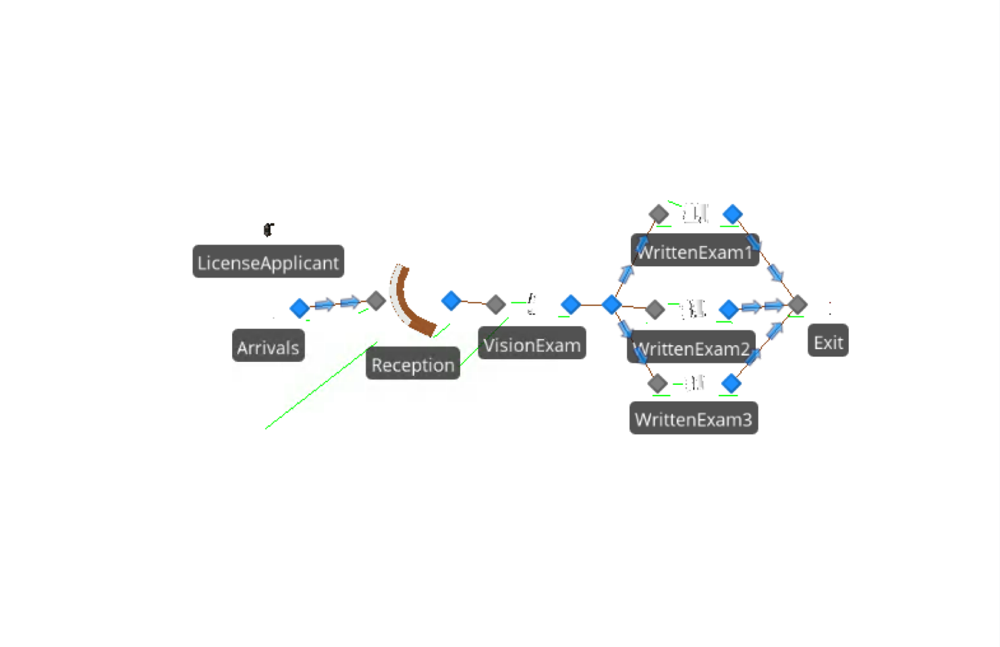
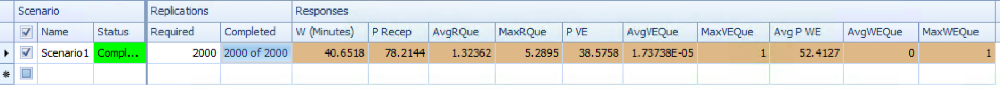
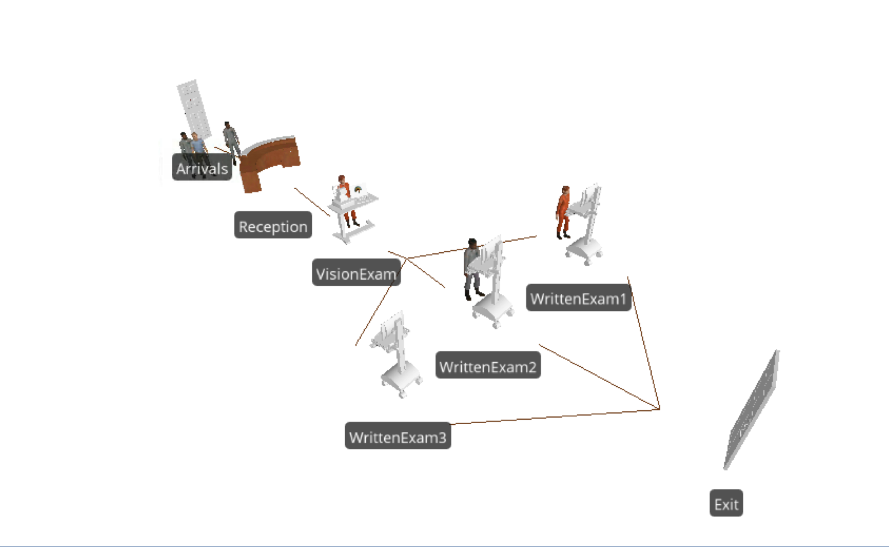

# Kelton 5.7.1

What is the difference between object property and object state?

__An object property is a variable that defines some aspect of that object's behavoir.   An object state is a variable that captures some aspect of an object's behavoir at a given point in time.  An object state can be either discrete (be captured only at given intervals) or continuous (captured continuously).__

# Kelton 5.7.2

Consider a process associated with a Server object.   What is the difference between a token's parent object and it's associated object?

__In an instance where a process is associated with a Server type object, a token will have references to both the parent object (Server) and the associated object (or reason a token started the execution of said process).__

# Kelton 5.7.3

Develop a queuing model that gives the steady-state values analogous to the values in Table 5.2 (Model 5-1). 

* Arrival Rate:  $\lambda$ = 10
* Placement Service Rate: $\mu_p$ = 15
* Inspector Service Rate: $\mu_i$ = 20

```{r}
MMC <- function(lambda, mu, c){
    # simulation of an MMC Queue system
    #
    # Args: 
    #   lambda: arrival rate
    #   mu: service time at each c
    #   c:  number of servers
    #
    # Returns:
    #   summary df showing - 
    #   Wq: avg time spent in queue
    #   W:  avg time spent in system
    #   Lq:  avg num entitites in queue
    #   L:  avg number of entities in the system
    #   p:  server utilization rate
    
    p <- lambda / (c * mu)
    
    # get steady state probability the system is empty
    i <- c(0:(c-1))
    first <- sum((c * p) ^ i / factorial(i))
    p0 <- 1 / (first + (c * p) ^ c / ( factorial(c) * (1-p)))  
    
    Lq <- ((p*(c*p)^c)*p0) / (factorial(c)*(1-p)^2)
    Wq <- Lq / lambda
    W <- Wq + 1 / mu
    L <- Lq + lambda / mu
    
    results <- data.frame(Wq, W, Lq, L, p)
    results    
}
```

```{r}
Placement <- MMC(10, 15, 1) #Placement
Inspector <- MMC(10, 20, 1) #Inspector
Combined <- Placement + Inspector
Network <- Combined[1:4]
Network$Pp <- Placement$p
Network$Pi <- Inspector$p
knitr::kable(Network)
```

# Kelton 5.7.4

Consider an office where people come to get their licenses.  3 servers:   reception / application; vision exam; written exam.   

* Arrivals:   pois(6 per hr)
* Reception:   triangular(5, 8, 11), 1 server
* Vision Exam:   triangular(2, 4, 6), 1 server
* Written Exam:  triangular(15, 15, 20), 3 servers

Office opens at 9am, closes at 5pm.   Find: 

* W - time customers spend in system
* utilization of each server station
* Lq and max - time spent in each of the 3 queues

How many replications should be run to be confident of results?  

# Kelton 5.7.5

Animate 5.7.4.   Make sure to use path objects and make sure distances and walking speeds are reasonable. 

## Simio Model

The full Simio Model can be obtained at https://github.com/wwells/CUNY_DATA_604/blob/master/Section6/Model_5.7.4and5.spfx?raw=true

## Model Layout



## Overview

We setup a node list and a transfer node to manage the 3 written exam stations.  I tried to setup a work schedule and assign it to each of the stations, but found it cumbersome to similarly control the behavior of arrivals so that when office hours were closed they stopped arriving and didn't blow up the Reception Queue. 

Instead I opted to simply run an experiment 2000 times at 8 hrs.  We picked a large number since one of the statistics we're looking for is max number in queue.   For each of the requested values, we setup a response variable to capture the appropriate information.   

## Response

The challenge here was to confirm that queues never really built up at the Vision Exam or the transfer node before the Written Exam servers.  The system as a whole works fairly well, with the overall queue forming in reception.   Once license applicants are into the system, they don't really wait at any one station.




## Animated



