# Kelton 5.7.6 and 5.7.7

Modify Model 5-2 so that inspection workers overlap for the first hour of one shift and the last hour of the other.   Compare the results of the models.   Does having inspectors overlap help?

Modify Model 5-2 so that if a board fails inspection more than two times it is rejected as a bad part.   Count the number of boards that are rejected because of 3 or more failures of inspection.

## Model

The modified model can be found at https://github.com/wwells/CUNY_DATA_604/raw/master/Section7/PCB_5.2_Week7.spfx

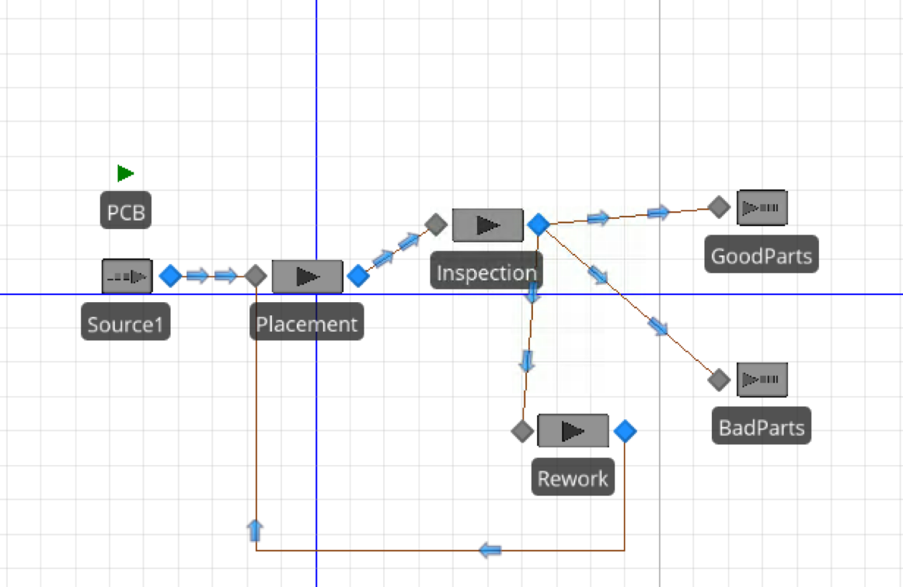

## Experiment Design

We used the same as mentioned in Kelton on the buildout of model 5-2.   25 reps, 1200 hrs, 200 hr warm up. 

## 5.7.6 - Inspection Schedule

To test this we ran the same experiment twice and modified the schedule.  The schedule was modified so that during the overlap periods there was a capacity of 2 instead of 1 (value).  

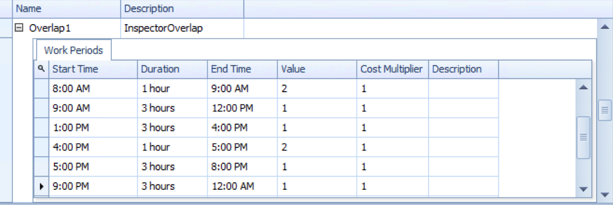

#### Original Inspection Schedule

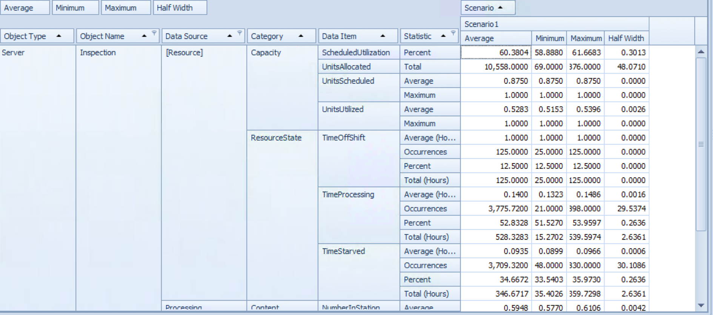

#### Overlapping Inspection Schedule

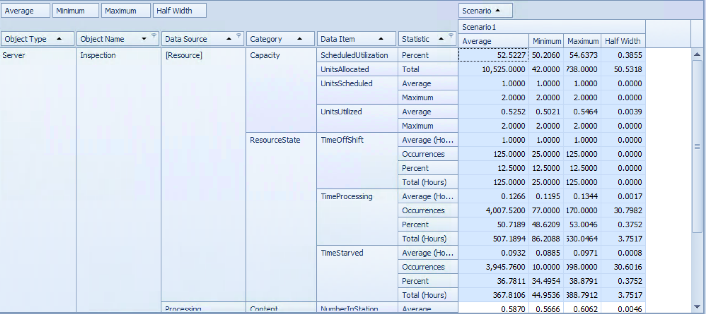

## 5.7.7 - Rejection

In the original Model 5-2, the updating of the "Times Processed" state assignment was done in the Placement server of the facility.   By moving the updating of this state assignment to the Inspection server, we are able to prevent any boards rejected a 3rd time from going anywhere but the BadParts Sink. 

We can see by using this method, we've cut down drastically on our BadParts, with ~25 created per 1200 Hrs. 

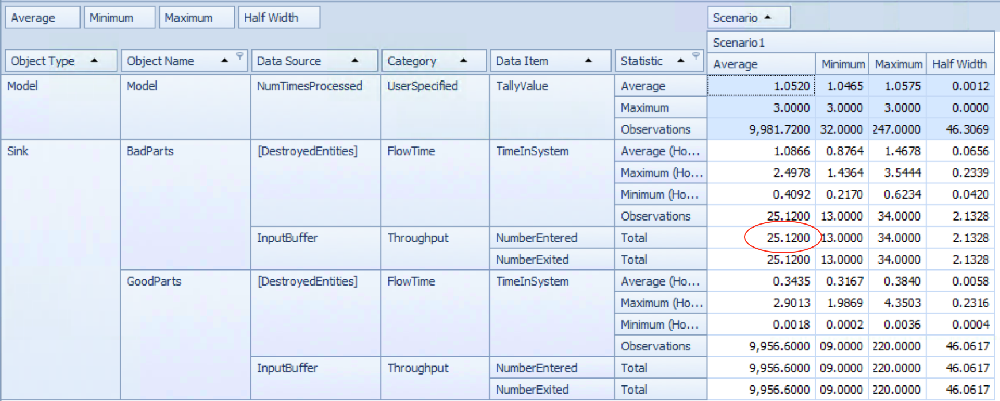

# Kelton 5.7.8

In model 5-3 we indicated that as part of the model verification, we predicated the proportions of parts that would go to the fast, medium, and slow fine-pitch placement machines (38%, 33%, and 29% respectively).   Develop a queuing model to estimate these proportions. 

Our 5-3 Model can be found at https://github.com/wwells/CUNY_DATA_604/raw/master/Section7/PCB_5.3_Week7.spfx

After creating state variables and output statistics to track the number of times a pitch server was chosen, we came up with the following results (running an experiment of the same duration as above). 

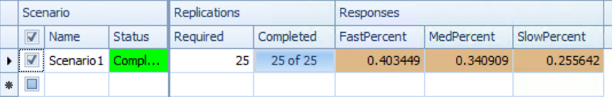

# Kelton 5.7.9

We'll use lots of tables to solve this problem.

Our model can be found at: https://github.com/wwells/CUNY_DATA_604/raw/master/Section7/KeltonPharmacy_5.7.9_Week7.spfx

## Model

Our Model relies on two types of customers defined by a Customer Table.   Routing is defined by the sequence table.   WorkSchedules and RateTables define server capacity, RVs and customer arrival rates throughout the workday. 

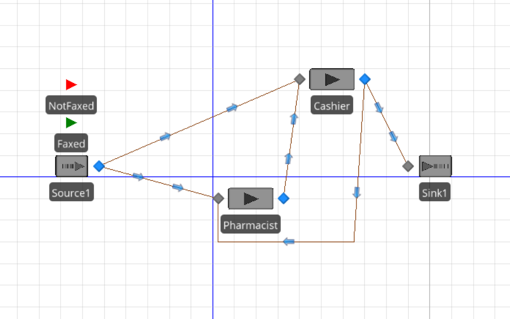

## Customer Table

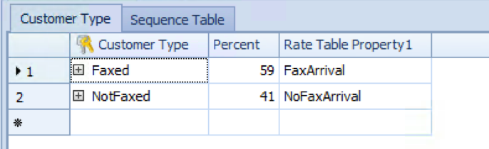

## Sequence Table

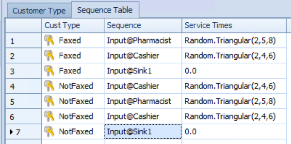

## Arrival Rate

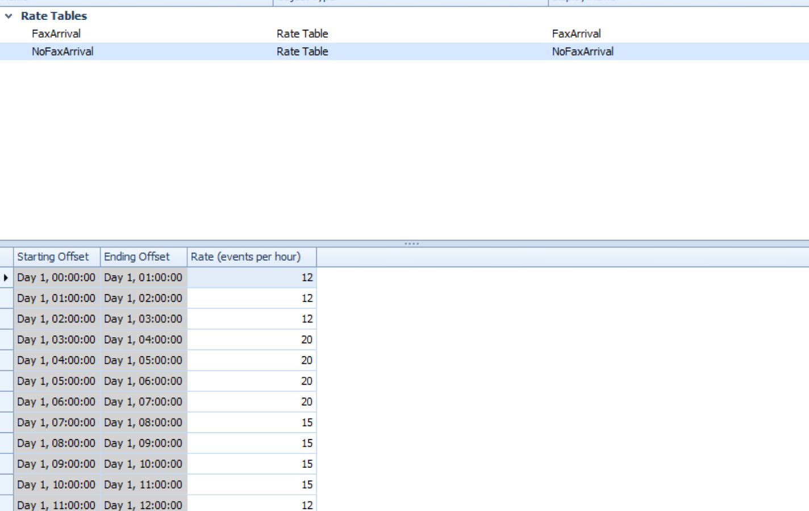

## WorkSchedules
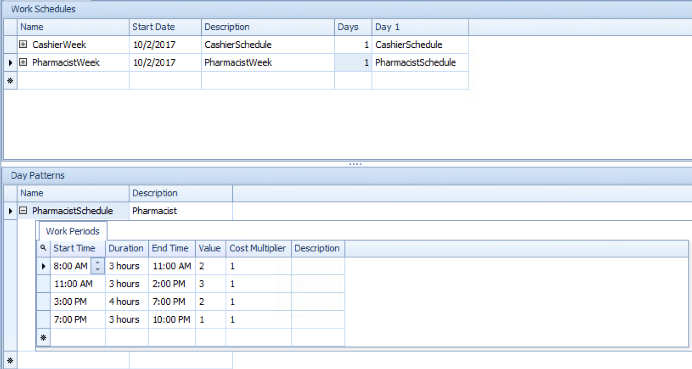

## Results

Because of the way we setup our pharmacy model, it assumes that a Faxed-In customer has entered the store when their prescription is first faxed.   Thus, we needed to define a tally statistic to help us understand the timing on a) how long it takes pharmacists to fill that class of prescription and b) be able to subtract that number from the rest of their time in system to determine how long they were actually in the store.   

Experiment results and sample plots are below. 

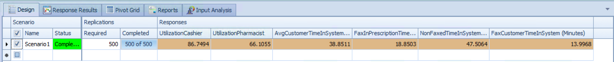

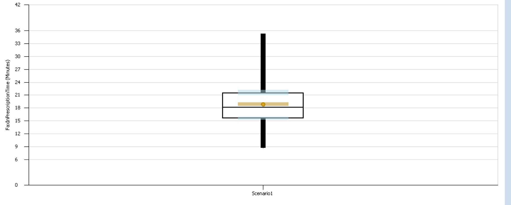

# References

* [VIDEO: Lab 6 - V2: Simio Tables, Data Table, Sequence Table](https://www.youtube.com/watch?v=0teGLoa_UkM)
* Joines Chapter 4 & 5

