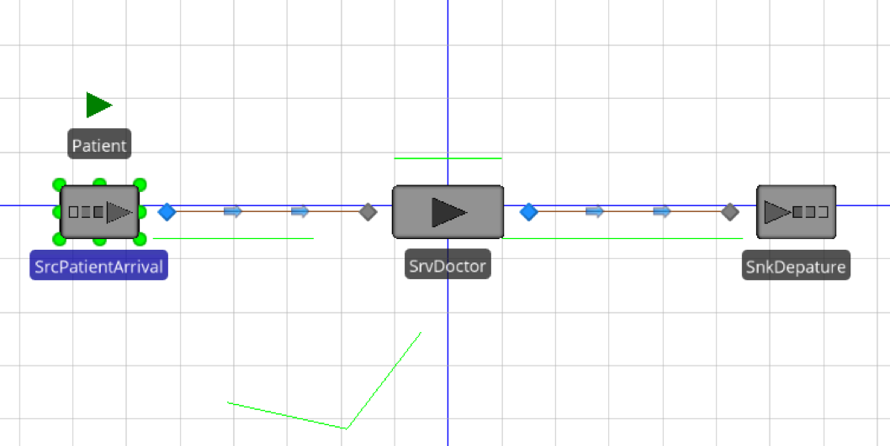
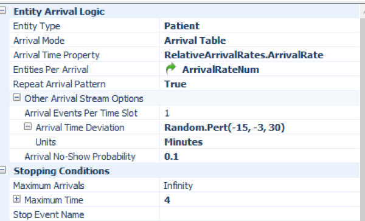
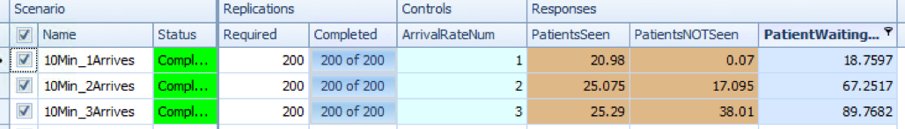
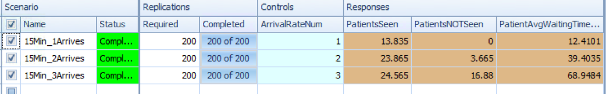
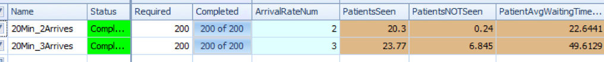

# Kelton 7.9.6

A small free clinic has a single doctor who sees patients between 8:00am and noon.   She spends 6 to 14 minutes (avg of 10) with each patient and so can theoretically see 6 patients per hour or a total of 24 each day.   Staff is currently scheduling patient arrivals every 10 minutes, but have found that patients arrive as much as 15 minutes early or 30 minutes late, thus causing disruption to other patients.   Worse, about 10% of patients never show up at all causing the doctor's time to be wasted and wasting an appointment that could have been used by other sick patients.   Staff would like ot evaluate alternative scheduling strategies such as scheduling 2-3 arrivals every 20 minutes with the main objective of maximizing the doctors utilization (eg she would really like to see 24 patients each day if possible).   Assume that the doctor will stay untill all scheduled patients are seen, but she is very unhappy if she needs to stay past 12:30.   Measure system performance mainly on the number of patients seen, but also consider the average patient waiting time, and how late the doctor must typically stay to see all the scheduled patients. 

## Model

The Clinic model is available at:  https://github.com/wwells/CUNY_DATA_604/raw/master/Section9/FreeClinic_7.9.6_10min.spfx

The layout is quite simple, the nuances are in the tables and use of an arrival schedule. 

## Managing Arrivals

The biggest challenges are around the use of an arrival schedule to experiment with different arrival values.  Specifying an Arrival Table for Arrival Mode opens up a number of great options custom suited for this problem like Arrival Time Deviation and Probability of No-Shows.  

This also allowed us to specify a stop time for arrivals right at Noon.   We only let our model run to 12:30 so as not to upset the clinic doctor.  

## Experiment Design

A better Simio user would have found a good way to make these Arrival Table values a referenceable property and thus could change and run multiple experiments around them.   I was able to create a reference property to indicate how many patients arrived at a given time, but I was not able to easily change the arrival time interval itself in Experiments.

As a result, I built 3 models in the same file (copying and pasting values) and then ran experiments comparing the multiple properties.   The top level of the 3 experiments is time:  10, 15, 20 minute scheduled arrivals.  Within each experiment we also control for how many patients arrive at that given interval. 

We are looking at:  

* __PatientsSeen__:  Patient.Population.NumberDestroyed
* __PatientsNOTSeen__ (since we had a hard cutoff at 12:30): Patient.Population.NumberDestroyed - Patient.Population.NumberDestroyed
* __PatientAvgTime__:  Patient.Population.TimeInSystem.Average

## Experiment Results

In none of these do we get particularly close to 24 patients seen with 0 patients not seen.  The closest we get is probably the original 10min 1 personal arrival plan.

# References

* Joines - Chapter 8
